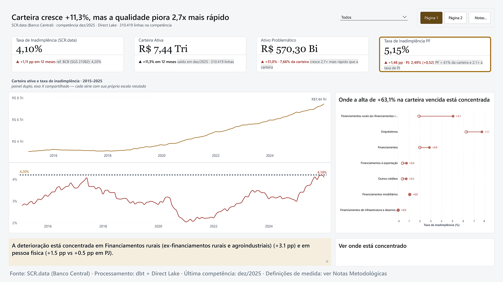

# Lumen — Camada Semântica "AI-Ready" + Agente Analítico Governado

> 🚧 Projeto em desenvolvimento — 8 de 12 sprints do plano entregues:
> engenharia de dados, migração para Microsoft Fabric, modelo semântico,
> dashboard Power BI e agente analítico governado.

## Visão

O Lumen é um projeto de engenharia de dados e BI que constrói uma camada
semântica certificada sobre dados públicos de crédito e indicadores
econômicos do Brasil (Banco Central, IBGE), com um agente analítico
governado capaz de responder perguntas em linguagem natural com base em
métricas certificadas — sem gerar SQL/DAX livre.

## Status atual

O projeto segue um plano de 12 sprints:

| Sprint | Entrega | Status |
|---|---|---|
| 1–5 | Fundação, Bronze, Silver, Gold (star schema em dbt) | ✅ |
| 6 | Modelo semântico Direct Lake + medidas certificadas | ✅ |
| 7 | AI-readiness: sinônimos, BPA na CI, RLS | ⏸️ adiada — RLS conflita com o agente (ver [ADR-015](docs/decision-log/adr-015-arquitetura-agente-governado.md)) |
| 8 | Dashboard Power BI (5 páginas) | ✅ |
| 9 | ML explicável: previsão de inadimplência e anomalias | ⬜ |
| 10 | Agente analítico governado | ✅ |
| 11 | Gabarito de 60 perguntas + baseline text-to-SQL | ⬜ |
| 12 | Benchmark agente × text-to-SQL e lançamento | ⬜ |

- **Nota sobre numeração:** ADRs e commits anteriores a setembro de 2026
  chamam o dashboard de "Sprint 7" e o agente de "Sprint 8". A numeração
  acima é a do plano original, que passa a valer daqui em diante.
- **Deliberadamente fora de escopo:** faixa sombreada da defasagem SCR/SGS
  na Página 3 e layout mobile da Página 1 — cortes conscientes, não
  esquecimentos (ver seção [Dashboard](#dashboard))
- **Última atualização:** setembro de 2026

### O que já existe

| Camada | Conteúdo |
|---|---|
| Bronze | 3 fontes ingeridas, append-only, com validação de schema e retry — rodando no Fabric (Lakehouse) |
| Silver | 5 tabelas limpas, tipadas e deduplicadas — rodando no Fabric |
| Gold | Star schema com 4 dimensões e 2 fatos (~34,4M linhas no fato principal) — dbt rodando sobre o Fabric via `dbt-fabricspark` |
| Modelo semântico | `lumen_semantico`, Direct Lake, catálogo de medidas certificadas versionado em `powerbi/medidas_certificadas_v2.dax`, publicado no workspace `lumen-dev` |
| Dashboard | Power BI de 5 páginas sobre o modelo semântico — tema (`powerbi/lumen_theme_v2.json`), visuais Deneb versionados em `powerbi/deneb/` (ver seção [Dashboard](#dashboard)) |
| Agente | Perguntas em português respondidas com as medidas certificadas, sem DAX livre, com interface Streamlit autenticada (ver seção [Agente analítico](#agente-analítico)) |

**Qualidade:** 86 testes pytest (dados, governança do agente e corretor
da avaliação) + 23 testes dbt, rodando na CI a cada PR.

**Validação:** reconciliação do total agregado do SCR.data com a série
oficial do BCB realizada — convergência com divergência metodológica
documentada (ver `docs/data-dictionary.md`).

## Stack atual

Python, dbt, GitHub Actions, Microsoft Fabric (Lakehouse + Direct Lake),
Power BI (Direct Lake + tema customizado) e Deneb/Vega-Lite para o único
visual não-nativo do dashboard. O agente usa a API gratuita do Google
(Gemini e Gemma 4) e Streamlit. Execução local com DuckDB permanece
disponível como target de desenvolvimento/CI (ver ADR-001 e ADR-008 para
o histórico da migração).

## Dashboard



> A imagem acima é da Página 1 (Visão Geral). O relatório completo tem 5
> páginas — Visão Geral, Onde, Contexto Macro, Ficha de Segmento
> (drill-through) e Notas Metodológicas — e roda 100% sobre o modelo
> semântico Direct Lake (`powerbi/lumen_dashboard.pbix`), sem publicação
> pública (workspace `lumen-dev` é um ambiente de desenvolvimento).

### Três decisões de design que eu mais defendo

1. **Toda medida de "período atual" passa por uma única âncora dinâmica,
   nunca por `MAX()`, `SAMEPERIODLASTYEAR()` ou data literal.**
   `dim_calendario` é gerada por `dbt_utils.date_spine()` até 2026-12-31 —
   bem além do fim real dos dados (dez/2025) — e o relacionamento
   `fato_credito → dim_calendario` é OneDirection. Sem uma âncora que force
   `CROSSFILTER(..., BOTH)`, qualquer medida de "competência atual" escaneia
   o calendário inteiro e erra silenciosamente. Essa mesma classe de erro
   apareceu 4 vezes neste projeto (`ADR-010`, `ADR-011`, `ADR-014`, e de
   novo no aviso de decomposição 2015-2016) até virar regra fixa: toda
   medida nova passa por `[Última Competência com Crédito]`, sem exceção,
   verificada uma a uma antes de ser certificada.
2. **Field parameter trocado por slicer na Página 2 (`ADR-013`), contra a
   recomendação literal da auditoria.** A auditoria pedia field parameter
   para o corte de cliente (PF/PJ) porque "muda a pergunta" em vez de só
   filtrar. A documentação oficial do Power BI é explícita: não dá para
   criar parâmetros em fontes de conexão live sem modelo local — e um
   modelo local decisão que já rejeitei antes (`ADR-009`) para não duplicar
   34,4M de linhas. Prefiro manter a arquitetura Direct Lake e usar um
   slicer comum, com o trade-off documentado, a violar uma decisão
   estrutural anterior por uma diferença semântica de interação.
3. **O painel duplo da Página 1 resolve o desalinhamento desligando o eixo
   Y em vez de compensar por pixel.** As duas séries (carteira ativa e
   taxa de inadimplência) têm rótulos de eixo Y de larguras diferentes
   ("R$ 8 Tri" vs. "4%"), e o Power BI calcula a área de plot de cada
   visual de forma independente — sem alinhamento nativo entre eles. A
   correção óbvia seria empurrar um painel alguns pixels e redimensionar o
   outro, mas isso quebra a cada mudança de fonte, DPI ou resolução de
   tela. Desligar o eixo de valor (mantendo gridlines, rótulo de ponta e
   rótulo da linha de referência do BCB, que já dão a escala) resolve o
   alinhamento de um jeito que não depende de nenhuma medida em pixels.

## Agente analítico

Responde perguntas em português sobre crédito no Brasil usando **só** as
medidas certificadas do modelo semântico. O modelo de linguagem nunca
escreve DAX: ele escolhe, de listas fechadas, uma medida, cortes (UF,
modalidade, cliente, competência...) e valores, e o código monta a
consulta de forma determinística.

```
pergunta ──▶ LLM escolhe medida + cortes ──▶ validação contra o catálogo ──▶ DAX montado por código
                        ▲                            │ inválido: recusa com as opções válidas
                        └──── resultado formatado ◀──┴── executeQueries no lumen_semantico
```

**O que isso garante, e como foi medido** (avaliação de 2026-09-18, 16
casos, modelo `gemma-4-26b-a4b-it`, gabarito calculado na hora pela
própria camada certificada):

- **12/12** perguntas factuais com valor e DAX certos — taxa atual,
  filtro por UF, competência histórica, rankings, referência do BCB.
- **4/4** recusas corretas — banco, previsão, município, juros — sem
  número inventado e oferecendo o que dá para responder.
- **Lastro:** todo número da resposta tem que ter vindo de uma consulta
  na conversa. Placar: 15/16 pela regra original, 16/16 depois de um
  ajuste feito *após* a falha — o motivo está registrado no ADR-015.

Detalhes das proteções em [`agent/guardrails.md`](agent/guardrails.md).
Decisões e o diagnóstico de acesso ao modelo (por que a conexão usa
identidade fixa, sem SSO) em
[ADR-015](docs/decision-log/adr-015-arquitetura-agente-governado.md).

### Como rodar

Crie um `.env` na raiz (fora do git) com:

```
GEMINI_API_KEY=...          # gratuita em https://aistudio.google.com/apikey
LUMEN_SENHA_DEMO=...        # senha de entrada da demonstração
```

As credenciais do Fabric vêm do `~/.dbt/profiles.yml` (o mesmo SPN do
dbt) ou das variáveis `FABRIC_TENANT_ID`, `FABRIC_CLIENT_ID` e
`FABRIC_CLIENT_SECRET`.

```bash
streamlit run agent/app.py                              # interface
python -m agent.avaliacao --modelo gemma-4-26b-a4b-it   # avaliação (consome cota da API)
```

Usa o nível gratuito da API: com cota esgotada, o agente passa para o
próximo modelo da cadeia de reserva, e a avaliação espera a janela de
cota virar.

## Decisões técnicas (ADRs)

As decisões de arquitetura são documentadas em `docs/decision-log/`
conforme acontecem no desenvolvimento real — não como uma lista fixa
predefinida.

- **ADR-001**: Execução local com DuckDB nas Sprints 1-5, com plano
  explícito de migração para Microsoft Fabric na Sprint 6
- **ADR-002**: Ingestão do SCR.data via download de ZIP anual (não OData,
  como originalmente planejado)
- **ADR-003**: Correção arquitetural — camada Bronze deve ser append-only
  (identificado em revisão de código por colega sênior)
- **ADR-004**: Correção arquitetural — camada Silver mantém granularidade
  total da fonte; agregação fica para a Gold
- **ADR-005**: Adoção incremental de type hints a partir da Sprint 6
- **ADR-006**: Manutenção de DOUBLE (não DECIMAL) para colunas monetárias
- **ADR-007**: Materialização full-refresh na fase local, incremental avaliada na Sprint 6
- **ADR-008**: Migração para Microsoft Fabric concluída — SPN em vez de CLI, capacity de trial, `dim_calendario` portável
- **ADR-009**: Modelo semântico Direct Lake publicado sobre a Gold do Fabric
- **ADR-010**: Correção das medidas certificadas de `SUM()` para
  `LASTNONBLANKVALUE` — as medidas de saldo são semiaditivas e não podem
  somar competências no tempo
- **ADR-011**: Correção dos comparativos ano a ano (`SAMEPERIODLASTYEAR`
  sem âncora herdava o fim do calendário gerado, não o fim real dos dados)
  e do separador decimal em medidas de texto
- **ADR-012**: Investigação parcial de uma divergência entre o modelo
  publicado no Fabric e o `lumen.duckdb` local para uma competência
  específica — causa raiz não totalmente confirmada, registrada com
  honestidade em vez de escondida
- **ADR-013**: Field parameter da Página 2 ("Cliente") substituído por
  slicer comum — parâmetros não podem ser criados em fontes de conexão
  live sem modelo local, o que descaracterizaria a arquitetura Direct Lake
- **ADR-014**: Terceira ocorrência do padrão de data fixa em vez de âncora
  dinâmica (medidas do dumbbell da Página 1) — mesma classe de erro do
  ADR-010/011, agora com literal `DATE(...)` em vez de time intelligence
  sem âncora
- **ADR-015**: Arquitetura do agente governado — o LLM escolhe medidas de
  um catálogo fechado e o DAX é montado por código; conexão do modelo com
  identidade fixa (entidade de serviço não é aceita com SSO); troca de
  Claude para Gemini/Gemma pelo custo zero; resultado da avaliação e o
  ajuste da regra de lastro feito depois de uma falha

## Estrutura do projeto

common/ → utilitários compartilhados (logging estruturado)
ingestion/ → scripts de ingestão (Bronze) local, versão DuckDB
transform/silver/ → scripts de transformação (Silver) local, versão DuckDB
transform/dbt/ → projeto dbt (staging + star schema Gold) — roda contra
  DuckDB local (`--target dev`) ou Fabric (`--target fabric`)
fabric/notebooks/ → notebooks PySpark (Bronze + Silver) para rodar no
  Fabric — equivalentes aos scripts de ingestion/ e transform/silver/
tests/ → testes de qualidade (pytest) e utilitários de CI
docs/ → dicionário de dados, ADRs, arquitetura
powerbi/ → catálogo de medidas DAX, tema do relatório e specs Deneb
  (Vega-Lite) do dashboard (Sprint 8)
agent/ → agente analítico (Sprint 10): acesso ao modelo, catálogo,
  consulta governada, ferramentas, interface, avaliação e guardrails

## Fontes de dados

- **SGS (Banco Central)**: séries temporais de Selic, IPCA, crédito nacional
- **SCR.data (Banco Central)**: crédito por UF, modalidade e segmento
  (~34,4 milhões de linhas, 2015-2025)
- **IBGE**: localidades e população por UF

Detalhes completos em `docs/data-dictionary.md` e `ingestion/contracts/`.

## Como reproduzir

Instruções completas de setup serão adicionadas ao final da fase de
engenharia de dados. Resumo atual:

```bash
python -m venv .venv && source .venv/Scripts/activate
pip install -r requirements.txt

python ingestion/ingestir_sgs.py
python ingestion/ingestir_scr_data.py   # ~2GB de download, leva tempo
python ingestion/ingestir_ibge.py

python transform/silver/silver_sgs.py
python transform/silver/silver_scr_data.py
python transform/silver/silver_ibge.py

cd transform/dbt && dbt build
```
